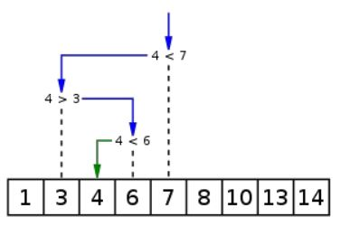

Бинарный поиск Контекст Предположим, что мы хотим найти элемент в массиве (получить его индекс). 

Мы можем это сделать просто перебрав все элементы. Но что, если массив уже отсортирован? В этом случае можно использовать бинарный поиск. Принцип прост: сначала берём элемент находящийся посередине и сравниваем с тем, который мы хотим найти. Если центральный элемент больше нашего, рассматриваем массив слева от центрального, а если больше - справа и повторяем так до тех пор, пока не найдем наш элемент.  

● Ваша задача Написать программу на любом языке в любой парадигме для бинарного поиска. На вход подаётся целочисленный массив и число. На выходе - индекс элемента или -1, в случае если искомого элемента нет в массиве.

